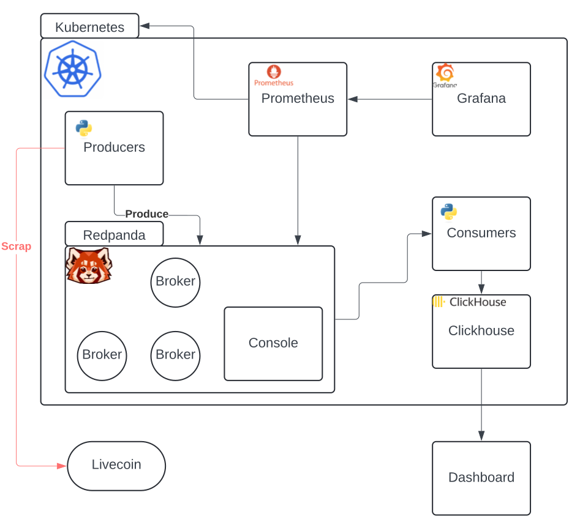

# Crypto-Data

# TODO

- [x] Create basic readme to allow all group to use and work on project
- [x] Create python scraper to get cryptos
- [x] Make scraper push in redpanda using kafka API
- [x] Add monitoring to Kube cluster and Redpanda
- [x] Deploy redpanda cluster with wright configuration
- [ ] Add distributed Database to save transformed data (cassandra,scyllaDB,CockroachDB)
- [ ] Update readme with redpanda dashboard creation
- [ ] Investigate Clickhouse project to find if it fits our plans
- [ ] Create final front to display our datas
- [ ] Create Consumer to transform data and push it in DB
- [ ] Improve cluster security to protect our datas (follow kubescore advices add security scans and enhance docker image creation)

## Diagram ## 




## Setup ## 

Install kafka using Helm:

```bash
helm install kafka oci://registry-1.docker.io/bitnamicharts/kafka -n kafka\
  --set metrics.jmx.enabled=true \
  --set metrics.kafka.enabled=true \
  --set metrics.serviceMonitor.enabled=true \
  --set metrics.serviceMonitor.namespace=default \
  --set metrics.prometheusRule.enabled=true \
  --set metrics.prometheusRule.namespace="default"
```

```bash
helm repo add prometheus-community https://prometheus-community.github.io/helm-charts
helm repo update
helm install prometheus-operator prometheus-community/kube-prometheus-stack \
  --namespace default \
  --create-namespace
  --values prometheus-values.yaml
```


get grafana admin password
```bash
sudo kubectl get secret --namespace default prometheus-operator-grafana  -o jsonpath="{.data.admin-password}" | base64 --decode ; echo
```
Install the Redpanda Helm chart to deploy a Redpanda cluster and Redpanda Console.


```bash
helm repo add redpanda https://charts.redpanda.com
helm install redpanda redpanda/redpanda \
  --version 5.9.4 \
  --namespace redpanda \
  --create-namespace \
  --values redpanda-values.yaml
```

```bash
helm install my-release oci://registry-1.docker.io/bitnamicharts/kafka \
  --namespace kafka \
  --create-namespace \
  --values kafka-values.yaml
```

## OPS ##

```bash
helm upgrade --install redpanda redpanda/redpanda \
  --namespace redpanda \
  --create-namespace \
  --values redpanda-values.yaml
```

## SETUP CLUSTER ##

### monitoring

```bash
kubectl apply -f redpanda-servicemonitor.yaml
```

### create topic 

```bash
kubectl exec -it redpanda-0 -n redpanda -- rpk topic create crypto-prices --partitions 3 -c compression.type=lz4 
```

### create producer

``` bash
docker build -t redpanda-producer:1.0.0 ./scraper  
```

``` bash
kubectl apply -f redpanda-producer.yaml -n redpanda 
```

Note : this way of creating producer work for `orbstack` kube cluster for any other you may need to find a way to push image to the cluster repository

## Sources ##

- ### [Redpanda](https://docs.redpanda.com/current/deploy/deployment-option/self-hosted/kubernetes/k-production-deployment/)
- ### [Helm](https://helm.sh/docs/)
- ### [minikube](https://minikube.sigs.k8s.io/docs/start/?arch=%2Fmacos%2Farm64%2Fstable%2Fbinary+download)
- ### [kind](https://kind.sigs.k8s.io/)
- ### [orbstack](https://orbstack.dev/download)